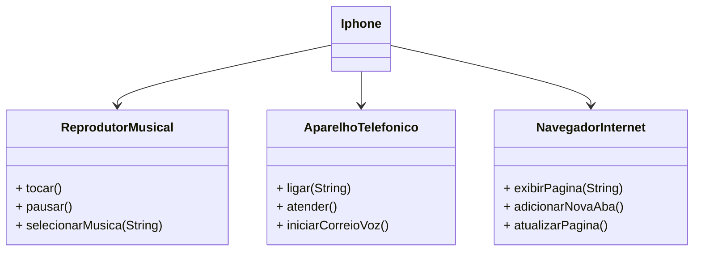

```mermaid
classDiagram
class Iphone {
   
}

class ReprodutorMusical {
    + tocar()
    + pausar()
    + selecionarMusica(String)
}

class AparelhoTelefonico {
    + ligar(String)
    + atender()
    + iniciarCorreioVoz()
}

class NavegadorInternet {
    + exibirPagina(String)
    + adicionarNovaAba()
    + atualizarPagina()
}

Iphone --> ReprodutorMusical
Iphone --> AparelhoTelefonico
Iphone --> NavegadorInternet
```